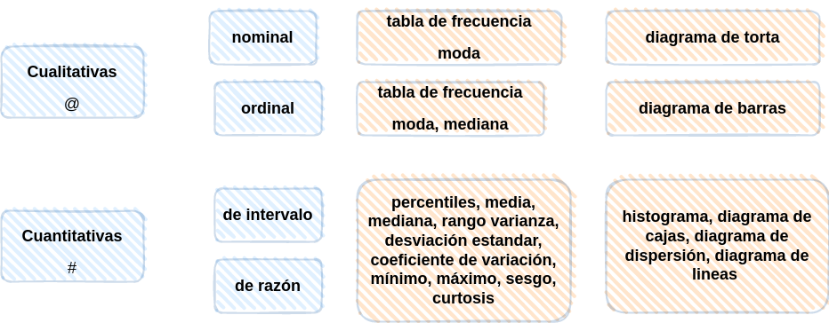

```{r setup, include=FALSE}
library(learnr)
knitr::opts_chunk$set(echo = FALSE,
                 exercise.warn_invisible = FALSE)
# colores
c0="#0DA5A6" # VERDE CLARO
c1="#E77C00" # NARANJA
c2="#6666FF" # AZUL  
c3="#4CBFBA" # VERDE CLARO  
c4="#E09600" # AMARILLO  
c5="#BC2B6A" # MORADO

```


## **PRESENTACIÓN**

```{r, echo=FALSE, out.width="100%", fig.align = "center"}

```

</br></br>

### **CONCEPTOS**

R es un lenguaje de programación para la realización de análisis estadísticos que está compuesto por un gran número de librerias. 


</br></br>

### **MAPA CONCEPTUAL**

```{r, echo=FALSE, , out.width="80%", fig.align = "center"}
  

```

</br></br>

## **CUESTIONARIO**

### PREGUNTA 1

ENUNCIADO


```{r p1, exercise=TRUE, exercise.lines = 5}

```


```{r p1-hint}


```


### PREGUNTA 2

ENUNCIADO


```{r p2, exercise=TRUE, exercise.lines = 5}

```


```{r p2-hint}


```


### PREGUNTA 3

ENUNCIADO


```{r p3, exercise=TRUE, exercise.lines = 5}

```


```{r p3-hint}


```


### PREGUNTA 4

ENUNCIADO


```{r p4, exercise=TRUE, exercise.lines = 5}

```


```{r p4-hint}


```


### PREGUNTA 5

ENUNCIADO


```{r p5, exercise=TRUE, exercise.lines = 5}

```


```{r p5-hint}


```

