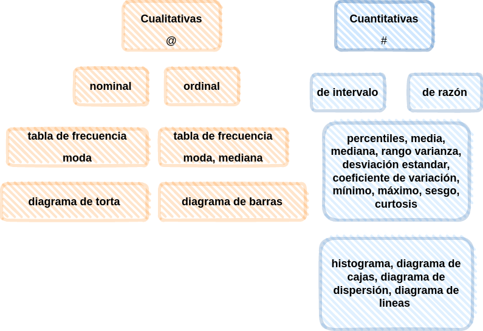

```{r setup, include=FALSE}
library(learnr)
knitr::opts_chunk$set(echo = FALSE,
                 exercise.warn_invisible = FALSE)
# colores
c0="#FF7F00" # naranja. color principal
c1="#034A94" # azul fuerte. color secundario
c2="#0EB0C6" # azul claro. color terciario  
c3="#686868" # gris. color texto  

c4="#0B2545" # azul oscuro  
c5="#E9C46A" # amarillo

```

## PRESENTACIÓN

```{r, echo=FALSE, out.width="100%", fig.align = "center"}
knitr::include_graphics("images/tutorial_encabezado.jpg")
```

El presente tutorial contiene preguntas relacionadas con los tipos de variables y sus esclas de medición, conceptos importantes en la elección de indicadores y representación gráfica de variables


### CONCEPTOS

###### **VARIABLE CUALITATIVA** : 

Se clasifican como variables cualitativas aquellas que toman valores no numéricos que pueden corresponde a factores o niveles de una variable aleatoria 

</br></br>

######  **VARIABLE CUANTITATIVA** : 

Son valores numéricos que pueden estar relacionados con mediciones y conteo de eventos. En otros casos son utilizadas de manera temporal para cuantificar variables no observables directamente y que se valoran a traves de test o cuestionarios con preguntas de opción multiple que puntuan de manera sumativa como son los casos del clima laboral, estres entre otros. Este proceso se denomina operacionalización de una variable cualitativa como cuantitativa.

</br>

######  **ESCALA NOMINAL** : 

Corresponde a valores no numéricos sin presencia de orden entre ellos. Los posibles operaciones al comparar dos valores son : $=$, $\neq$. 

</br>

######  **ESCALA ORDINAL** : 

Corresponde a valores no numéricos con presencia de orden entre ellos. Podemos compararlos mediante los operadores : $=$, $\neq$, $<$, $>$. 

</br>

######  **ESCALA DE INTERVALO** : 

Este tipo de escala se aplica a variables numéricas que pueden tener diferentes esclas de medición como por ejemplo la temperatura que se mide en grados Celsius, Kelvin o Fahrengeit . Esta escala permite los operadores de comparación : $=$, $\neq$, $<$, $>$, $-$.

</br>

######  **ESCALA DE RAZÓN** : 

Corresponde a variables numéricas para los cuales tiene sentido a demás de los operadores anteriores, la razón de dos de sus valores : $=$, $\neq$, $<$, $>$, $-$, $/$.

</br></br>

### MAPA CONCEPTUAL 


```{r, echo=FALSE, , out.width="80%", fig.align = "center"}
  

```

</br>

## CUESTIONARIO

```{r quiz_1}
quiz(
  question("Un estudio clasificó las personas con respecto al riesgo como: asversos al riesgo, neutral al riesgo y amantes al riesgo.
La  escala de medida utilizada es", 
  allow_retry = TRUE,
    answer("nominal", message = "Cerca, pero no...intentalo de nuevo!"),
    answer("ordinal", correct = TRUE),
    answer("de intervalo", message = "Incorrecto. Intenta de nuevo!."),
    answer("de razón", message = "Nop...intentalo de nuevo!"),
    # Si no cambiamos estos textos en los botones, se mostrarán en Inglés  
    submit_button = "Enviar respuesta",
    try_again_button = "Intentar de nuevo"),
  # Si no ponemos un caption aparecerá la palabra Quiz en inglés.
   caption = "Pregunta 1"
)
```

</br>

```{r quiz_2}
quiz( 
  question("No es una variable cuantitativa", 
  allow_retry = TRUE,
    answer("sexo (M,F)", message = "No, pero no...intentalo de nuevo!"),
    answer("bebe (nada, poco, ocasionalmente, mucho", message = "Nop...intentalo de nuevo!"),
    answer("número de llamadas recibidas en un dia", correct = TRUE),
    answer("nivel educativo de una persona", message = "Incorrecto. Intenta de nuevo!."),
    # Si no cambiamos estos textos en los botones, se mostrarán en Inglés  
    submit_button = "Enviar respuesta",
    try_again_button = "Intentar de nuevo"),
  # Si no ponemos un caption aparecerá la palabra Quiz en inglés.
   caption = "Pregunta 2"
 )
```

</br>

```{r quiz_3}
quiz(  
  question("Es una variable cualitativa medida en escal de razón", 
  allow_retry = TRUE,
    answer("el nivel de ansiedad de un estudiante", message = "No, pero no...intentalo de nuevo!"),
    answer("edad de una persona", correct = TRUE),
    answer("programa de posgrado en el que se encuentra matriculado", message = "Incorrecto. Intenta de nuevo!."),
    answer("marca del celuar que usa", message = "Nop...intentalo de nuevo!"),
    # Si no cambiamos estos textos en los botones, se mostrarán en Inglés  
    submit_button = "Enviar respuesta",
    try_again_button = "Intentar de nuevo"),
  # Si no ponemos un caption aparecerá la palabra Quiz en inglés.
   caption = "Pregunta 3"
)
```

</br>

