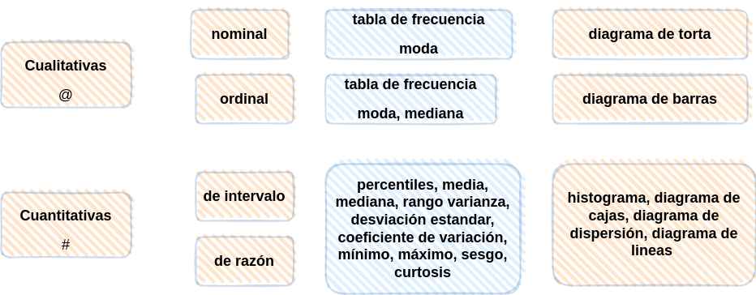

```{r setup, include=FALSE}
library(learnr)
knitr::opts_chunk$set(echo = FALSE,
                 exercise.warn_invisible = FALSE)
# colores
c0="#FF7F00" # naranja. color principal
c1="#034A94" # azul fuerte. color secundario
c2="#0EB0C6" # azul claro. color terciario  
c3="#686868" # gris. color texto  

c4="#0B2545" # azul oscuro  
c5="#E9C46A" # amarillo

```


## **PRESENTACIÓN**

```{r, echo=FALSE, out.width="100%", fig.align = "center"}
knitr::include_graphics("images/tutorial_encabezado.jpg")
```

</br></br>

### **CONCEPTOS**

Cuando realizamos un análisis datos es necesario el calculo de indicadores que faciliten su interpretación


#### **INDICADORES DE POSICIÓN**

Estan conformado por un grupo de datos que permiten realizar comparaciones de un dato con respecto al grupo. Dentro de ellos se destacan :

* Los PERCENTILES, que los conforman 99 números que dividen la muestra en 100 partes de igual porcentaje (cada uno de un 1%)

* Los DECILES, corresponden a 9 números que dividen la muestra en 10 partes de igual porcentaje (cada uno de un 10%)

* Los QUINTILES,correponden a 4 números que dividen la muestra en 5 partes de igual porcentaje (cada uno de un 20%)

* Los CUARTILES, son 3 números que dividen la muestra en 4 partes cada una con un 25%.  Con estos valores se construye el diagrama de cajas


#### **INDICADORES DE CENTRO**

Los indicadores de centro resumen en un solo número el conjunto de datos. Dentre de ellos se destacan : la media, mediana, moda, rango medio, media truncada


#### **INDICADORES DE DISPERSIÓN**

Conformado por un grupo de indicadores que nos muestran la variabilidad de los datos. Los principales indicadores de dispersión son : el rango, la varianza, la desviación estandar y el coeficiente de variación.


#### **INDICADORES DE FORMA**

Los indicadores de forma permiten analizar los datos respecto a su distribución que tiene dos dimensiones : el apuntamiento o curtosis y la asimetria o sesgo

</br></br>

#### **RESUMEN DE LOS PRINCIPALES INDICADORES**


|Estadística             | fórmula                               | código R                      |
|:-----------------------|:--------------------------------------|:------------------------------|
|**POSICIÓN**            |                                       |                               |
|percentil 25            |$X_{n \times 0.25}$                    |`quantile(x,0.25)`             |
|percentil 50            |$X_{n \times 0.50}$                    |`quantile(x,0.50)`             |
|percentil 75            |$X_{n \times 0.75}$                    |`quantile(x,0.75)`             |
|rango intercuartílico   |$Q_{3}-Q_{1}$                          |                               |
|**CENTRO**              |                                       |                               |
|media aritmética        | $\displaystyle\dfrac{1}{n}\sum_{i=1}^{n} x_{i}$    | `mean(x)`        |
|mediana                 | $Me = P_{50} = X_{n+1/2}$             | `median(x)`                   |
|moda                    | $Mo$ dato que más se repite           |                               |
|media truncada | media calculada con el 90% central de los datos|`mean(x,trim=10/100)`          |
|rango medio             | $rm=\dfrac{min\{x\}-max\{x\}}{2}$     | `max(x)-min(x)`               |
|media geométrica        | $(x_{1} \times x_{2} \times x_{3} .... x_{n})^{1/n}$  |               |
|media armónica          | $\dfrac{n}{\dfrac{1}{x_{1}}+\dfrac{1}{x_{2}}+\dfrac{1}{x_{3}}+...+\dfrac{1}{x_{n}}}$ |  |
|**DISPERSIÓN**          |                                       |                               |
|rango                   |$r= max\{x\}-min\{x\}$                 |`max(x)-min(x)`                |
|varianza                |$s^{2} = \dfrac{1}{n-1} \displaystyle\sum_{i=1}^{n}(x_{i}-\bar{x})^{2}$  |`var(x)` 
|desviación estandar     |$s = \sqrt{s^{2}}$                     |`sd(x)`                        |
|coeficiente de variación|$cv= \dfrac{s}{\bar{x}} \times 100$ %  |`sd(x)/mean(x)*100`            |
|**FORMA**               |                                       |                               |
|coeficiente de curtosis |$\displaystyle\dfrac{Q_{3}-Q_{1}}{P_{90}-P_{10}}$ |`rapportools::kurtosis(bpe$promedio)`|
|coeficiente de asimetría|$\displaystyle\dfrac{3(\bar{x}-Me)}{s}$|`rapportools::skewness(bpe$promedio)`|


</br></br>

### **MAPA CONCEPTUAL**

```{r, echo=FALSE, , out.width="80%", fig.align = "center"}
  

```

</br></br>

## **CUESTIONARIO**

### PREGUNTA 1

```{r quiz_1}
quiz(
  question("Comparar la media con la mediana de un conjunto de datos
te da una idea de la forma que tienen los datos", 
  allow_retry = TRUE,
    answer("Si la media es menor que la mediana indica que los datos presentan asimetria negativa ", correct = TRUE), 
    answer("Esta afirmación no es cierta debido a que los dos indicadores se construyen con formulas difenetes", message = "Nop...intentalo de nuevo!"),
    answer("La forma de los datos solo es posible conocerla cuando se construye una grafica de ellos", message = "Incorrecto. Intenta de nuevo!."),
    answer("Los valores de la media y la mediana no se pueden comparar, pues tienen unidades diferentes", message = "Cerca, pero no...intentalo de nuevo!"),
    # Si no cambiamos estos textos en los botones, se mostrarán en Inglés  
    submit_button = "Enviar respuesta",
    try_again_button = "Intentar de nuevo"),
  # Si no ponemos un caption aparecerá la palabra Quiz en inglés.
   caption = " "
)
```


### PREGUNTA 2

```{r quiz_2}
quiz( 
  question("La media, moda y mediana son :", 
  allow_retry = TRUE,
    answer("indicadores de variabilidad", message = "No, pero no...intentalo de nuevo!"),
    answer("indicadores de posición", message = "No...intentalo de nuevo!"),
    answer("tres parámetros de la población", message = "Incorrecto. Intenta de nuevo!."),
    answer("indicadores de tendencia central", correct = TRUE),
    # Si no cambiamos estos textos en los botones, se mostrarán en Inglés  
    submit_button = "Enviar respuesta",
    try_again_button = "Intentar de nuevo"),
  # Si no ponemos un caption aparecerá la palabra Quiz en inglés.
   caption = " "
 )
```


### PREGUNTA 3

```{r quiz_3}
quiz(  
  question("En una clase de Estadística, el número total de estudiantes no se conoce. En esta clase, 25% obtuvo cuatro
puntos, 30% alcanzó tres puntos, 20% se benefició con dos puntos, 15% logró un punto y 10% resultó con
cero puntos.", 
  allow_retry = TRUE,
    answer("Es posible calcular la moda", message = "Cerca, pero no...intentalo de nuevo!"),
    answer("Es posible encontrar el número de estudiantes que presentaron la prueba", message = "Nop...intentalo de nuevo!"),
    answer("Es posible calcular el coeficiente de variación de los datos", message = "Incorrecto. Intenta de nuevo!."),
    answer("Es posible calcular la mediana de la evaluación", correct = TRUE),
    # Si no cambiamos estos textos en los botones, se mostrarán en Inglés  
    submit_button = "Enviar respuesta",
    try_again_button = "Intentar de nuevo"),
  # Si no ponemos un caption aparecerá la palabra Quiz en inglés.
   caption = " "
)
```


### PREGUNTA 4

```{r quiz_4}
quiz(  
  question("Para calcular la moda es necesario", 
  allow_retry = TRUE,
    answer("calcular primero la media", message = "No, pero no...intentalo de nuevo!"),
    answer("no necesitamos tener los datos", message = "Nop...intentalo de nuevo!"),
    answer("contar el número de veces que aparece el valor más frecuente", correct = TRUE),
    answer("conocer el valor mínimo y el máximo de los datos", message = "Incorrecto. Intenta de nuevo!."),
    # Si no cambiamos estos textos en los botones, se mostrarán en Inglés  
    submit_button = "Enviar respuesta",
    try_again_button = "Intentar de nuevo"),
  # Si no ponemos un caption aparecerá la palabra Quiz en inglés.
   caption = " "
)
```


### PREGUNTA 5

```{r quiz_5}
quiz(  
  question("Si a todos los valores de un conjunto de datos se les suma una constante positiva $m$ entonces,", 
  allow_retry = TRUE,
    answer("la nueva media disminuye en esa constante $m$", message = "No, ...intentalo de nuevo!"),
    answer("la nueva media aumentará en esa constante $m$", correct = TRUE),
    answer("la nueva media quedará multiplicada por la constante $m$", message = "Incorrecto. Intenta de nuevo!."),
    answer("la nueva media no cambia",  message = "Incorrecto. Intenta de nuevo!."),
    # Si no cambiamos estos textos en los botones, se mostrarán en Inglés  
    submit_button = "Enviar respuesta",
    try_again_button = "Intentar de nuevo"),
  # Si no ponemos un caption aparecerá la palabra Quiz en inglés.
   caption = " "
)

```


### PREGUNTA 6

```{r quiz_6}
quiz(  
  question("Si a todos los valores de un conjunto de datos se les suma una constante positiva $m$ entonces,", 
  allow_retry = TRUE,
    answer("la nueva varianza disminuye en esa constante $m$", message = "No, ...intentalo de nuevo!"),
    answer("la nueva varianza aumentará en esa constante $m$",  message = "Incorrecto. Intenta de nuevo!."),
    answer("la nueva varianza quedará multiplicada por la constante $m$", message = "Incorrecto. Intenta de nuevo!."),
    answer("la nueva varianza no cambia", correct = TRUE), 
    # Si no cambiamos estos textos en los botones, se mostrarán en Inglés  
    submit_button = "Enviar respuesta",
    try_again_button = "Intentar de nuevo"),
  # Si no ponemos un caption aparecerá la palabra Quiz en inglés.
   caption = " "
)

```


### PREGUNTA 7

```{r quiz_7}
quiz(  
  question("Al mirar las notas de Estadı́stica observas que de los 120 almunos de la lista sólo te superan en nota 14. Puedes decir cno
razón que:", 
  allow_retry = TRUE,
    answer("he superado el noveno decil", message = "No, ...intentalo de nuevo!"),
    answer("mi nota corresponde al percentil 91",  message = "Incorrecto. Intenta de nuevo!."),
    answer("he superado el percentil 85", correct = TRUE),  
    answer("ninguna de las anteriores", message = "Incorrecto. Intenta de nuevo!."),
    # Si no cambiamos estos textos en los botones, se mostrarán en Inglés  
    submit_button = "Enviar respuesta",
    try_again_button = "Intentar de nuevo"),
  # Si no ponemos un caption aparecerá la palabra Quiz en inglés.
   caption = ""
)

```


## **PROBLEMAS PROPUESTOS**


### PROBLEMA 1

**R** contiene grupos  de datos  que pueden se usado para su aprendizaje. La función `data(iris)` carga en el sistema la base `iris`.  Se requiere calcular los principales indicadores de la variable `iris$Sepal.Length` (media, mediana, varianza, desviación estandar, mínimo y máximo). 

```{r p1, exercise=TRUE, exercise.lines = 10}
data(iris)

```


```{r p1-hint}
data(iris)
mean(iris$Sepal.Length)   # media
median(iris$Sepal.Length) # mediana
var(iris$Sepal.Length)    # varianza
sd(iris$Sepal.Length)     # desviación estandar
min(iris$Sepal.Length)    # mínimo
max(iris$Sepal.Length)    # máximo
```


</br>

La función : summarytools::descr(iris$Sepal.Length) genera un resumen de los principales indicadores. 

Nota: debe previamente haber instalado el paquete summarytools : `install.packages("summarytools")`

### PROBLEMA 2

ENUNCIADO


```{r p2, exercise=TRUE, exercise.lines = 5}

```


```{r p2-hint}


```


