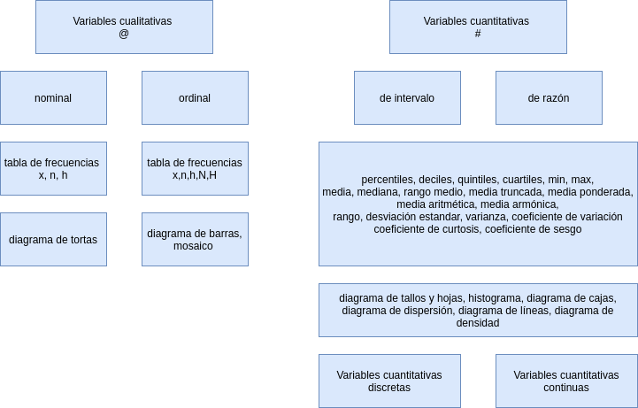

```{r setup, include=FALSE}
library(learnr)
knitr::opts_chunk$set(echo = FALSE,
                 exercise.warn_invisible = FALSE)
# colores
c1="#FF7F00" # NARANJA COLOR PRINCIPAL
c2="#034a94" # AZUL FUERTE COLOR SECUNDARIO  
c3="#0eb0c6" # AZUL CLARO COLOR TERCEARIO  
c4="#686868" # GRIS COLOR TEXTO 

```


## **PRESENTACIÓN**

```{r, echo=FALSE, out.width="100%", fig.align = "center"}

```

</br></br>

### **CONCEPTOS**

Cuando realizamos un análisis datos es necesario el calculo de indicadores que faciliten su interpretación. Para el caso de las variables cualitativas se utiliza como indicador de resumen la moda. Los siguientes indicadores corresponde a variables cuantitativas. 


</br></br>

#### **INDICADORES DE POSICIÓN**

Estan conformado por un grupo de datos que permiten realizar comparaciones de un dato con respecto al grupo. Dentro de ellos se destacan : 

* percentiles, 
* deciles, 
* quintiles, 
* cuartiles  


### **Nota**

Con los cuartiles tambien se construye el diagrama de cajas

|Indicador               | fórmula                               | código R                      |
|:-----------------------|:--------------------------------------|:------------------------------|
|percentil 25            |$X_{n \times 0.25}$                    |`quantile(x,0.25)`             |
|percentil 50            |$X_{n \times 0.50}$                    |`quantile(x,0.50)`             |
|percentil 75            |$X_{n \times 0.75}$                    |`quantile(x,0.75)`             |
|rango intercuartílico   |$Q_{3}-Q_{1}$                          |                               |
|                        |                                       |                               |


</br></br>

#### **INDICADORES DE CENTRO**

Los indicadores de centro resumen en un solo número el conjunto de datos. Dentre de ellos se destacan : la media, mediana, moda, rango medio, media truncada

|Indicador               | fórmula                               | código R                      |
|:-----------------------|:--------------------------------------|:------------------------------|
|media aritmética        | $\displaystyle\dfrac{1}{n}\sum_{i=1}^{n} x_{i}$    | `mean(x)`        |
|mediana                 | $Me = P_{50} = X_{n+1/2}$             | `median(x)`                   |
|moda                    | $Mo$ dato que más se repite           |                               |
|media truncada | media calculada con el 90% central de los datos|`mean(x,trim=10/100)`          |
|rango medio             | $rm=\dfrac{min\{x\}-max\{x\}}{2}$     | `max(x)-min(x)`               |
|media geométrica        | $(x_{1} \times x_{2} \times x_{3} .... x_{n})^{1/n}$  | `geometric<-function(x){exp(sum(log(x))/length(x))}` |
|media armónica          | $\dfrac{n}{\dfrac{1}{x_{1}}+\dfrac{1}{x_{2}}+\dfrac{1}{x_{3}}+...+\dfrac{1}{x_{n}}}$ | `armonic<- function(x){1/mean(1/x)}`|
|                        |                                       |                               |

</br></br>

#### **INDICADORES DE DISPERSIÓN**

Conformado por un grupo de indicadores que nos muestran la variabilidad de los datos. Los principales indicadores de dispersión son : el rango, la varianza, la desviación estandar y el coeficiente de variación.


|Indicador               | fórmula                               | código R                      |
|:-----------------------|:--------------------------------------|:------------------------------|
|rango                   |$r= max\{x\}-min\{x\}$                 |`max(x)-min(x)`                |
|varianza                |$s^{2} = \dfrac{1}{n-1} \displaystyle\sum_{i=1}^{n}(x_{i}-\bar{x})^{2}$  |`var(x)` 
|desviación estandar     |$s = \sqrt{s^{2}}$                     |`sd(x)`                        |
|coeficiente de variación|$cv= \dfrac{s}{\bar{x}} \times 100$ %  |`sd(x)/mean(x)*100`            |
|                        |                                       |                               |

</br></br>

#### **INDICADORES DE FORMA**

Los indicadores de forma permiten analizar los datos respecto a su distribución que tiene dos dimensiones : el apuntamiento o curtosis y la asimetria o sesgo

|Indicador               | fórmula                               | código R                      |
|:-----------------------|:--------------------------------------|:------------------------------|
|coeficiente de curtosis |$\displaystyle\dfrac{Q_{3}-Q_{1}}{P_{90}-P_{10}}$ |`rapportools::kurtosis(bpe$promedio)`|
|coeficiente de asimetría|$\displaystyle\dfrac{3(\bar{x}-Me)}{s}$|`rapportools::skewness(bpe$promedio)`|
|                        |                                       |                                     |

</br></br>


</br></br>

### **MAPA CONCEPTUAL**

```{r, echo=FALSE, , out.width="100%", fig.align = "center"}
  

```

</br></br>

## **CUESTIONARIO**

### PREGUNTA 1

Para la siguiente afirmación selecciona la opción correcta 

```{r quiz_1}
quiz(
  question("Comparar la media con la mediana de un conjunto de datos
te da una idea de la forma que tienen los datos", 
  allow_retry = TRUE,
    answer("Si la media es menor que la mediana indica que los datos presentan asimetria negativa ", correct = TRUE), 
    answer("Estos indicadores no se pueden comparar debido a que se construyen con fórmulas diferentes", message = "No...intentalo de nuevo!"),
    answer("La forma de los datos solo es posible conocerla cuando se construye una grafica de ellos", message = "Incorrecto. Intenta de nuevo!."),
    answer("Los valores de la media y la mediana no se pueden comparar, pues tienen unidades diferentes", message = "Cerca, pero no...intentalo de nuevo!"),
    # Si no cambiamos estos textos en los botones, se mostrarán en Inglés  
    submit_button = "Enviar respuesta",
    correct = "Correcto!",
    incorrect = "Incorrecto!",
    try_again_button = "Intentar de nuevo"),
  # Si no ponemos un caption aparecerá la palabra Quiz en inglés.
   caption = " "
)
```


### PREGUNTA 2

```{r quiz_2}
quiz( 
  question("La media, moda y mediana son :", 
  allow_retry = TRUE,
    answer("indicadores de variabilidad", message = "No, pero no...intentalo de nuevo!"),
    answer("indicadores de posición", message = "No...intentalo de nuevo!"),
    answer("tres parámetros de la población", message = "Incorrecto. Intenta de nuevo!."),
    answer("indicadores de tendencia central", correct = TRUE),
    # Si no cambiamos estos textos en los botones, se mostrarán en Inglés  
    submit_button = "Enviar respuesta",
      correct = "Correcto!",
    incorrect = "Incorrecto!",
    try_again_button = "Intentar de nuevo"),
  # Si no ponemos un caption aparecerá la palabra Quiz en inglés.
   caption = " "
 )
```


### PREGUNTA 3

```{r quiz_3}
quiz(  
  question("En una clase de Estadística, el número total de estudiantes no se conoce. En esta clase, 25% obtuvo cuatro
puntos, 30% alcanzó tres puntos, 20% se benefició con dos puntos, 15% logró un punto y 10% resultó con
cero puntos.", 
  allow_retry = TRUE,
    answer("Es posible calcular la moda", message = "Cerca, pero no...intentalo de nuevo!"),
    answer("Es posible encontrar el número de estudiantes que presentaron la prueba", message = "Nop...intentalo de nuevo!"),
    answer("Es posible calcular el coeficiente de variación de los datos", message = "Incorrecto. Intenta de nuevo!."),
    answer("Es posible calcular la mediana de la evaluación", correct = TRUE),
    # Si no cambiamos estos textos en los botones, se mostrarán en Inglés  
    submit_button = "Enviar respuesta",
    correct = "Correcto!",
    incorrect = "Incorrecto!",
    try_again_button = "Intentar de nuevo"),
  # Si no ponemos un caption aparecerá la palabra Quiz en inglés.
   caption = " "
)
```


### PREGUNTA 4

```{r quiz_4}
quiz(  
  question("Para calcular la moda es necesario", 
  allow_retry = TRUE,
    answer("calcular primero la media", message = "No, pero no...intentalo de nuevo!"),
    answer("no necesitamos tener los datos", message = "Nop...intentalo de nuevo!"),
    answer("contar el número de veces que aparece el valor más frecuente", correct = TRUE),
    answer("conocer el valor mínimo y el máximo de los datos", message = "Incorrecto. Intenta de nuevo!."),
    # Si no cambiamos estos textos en los botones, se mostrarán en Inglés  
    submit_button = "Enviar respuesta",
      correct = "Correcto!",
    incorrect = "Incorrecto!",
    try_again_button = "Intentar de nuevo"),
  # Si no ponemos un caption aparecerá la palabra Quiz en inglés.
   caption = " "
)
```


### PREGUNTA 5

```{r quiz_5}
quiz(  
  question("Si a todos los valores de un conjunto de datos se les suma una constante positiva $m$ entonces,", 
  allow_retry = TRUE,
    answer("la nueva media disminuye en esa constante $m$", message = "No, ...intentalo de nuevo!"),
    answer("la nueva media aumentará en esa constante $m$", correct = TRUE),
    answer("la nueva media quedará multiplicada por la constante $m$", message = "Incorrecto. Intenta de nuevo!."),
    answer("la nueva media no cambia",  message = "Incorrecto. Intenta de nuevo!."),
    # Si no cambiamos estos textos en los botones, se mostrarán en Inglés  
    submit_button = "Enviar respuesta",
      correct = "Correcto!",
    incorrect = "Incorrecto!",
    try_again_button = "Intentar de nuevo"),
  # Si no ponemos un caption aparecerá la palabra Quiz en inglés.
   caption = " "
)

```


### PREGUNTA 6

```{r quiz_6}
quiz(  
  question("Si a todos los valores de un conjunto de datos se les suma una constante positiva $m$ entonces,", 
  allow_retry = TRUE,
    answer("la nueva varianza disminuye en esa constante $m$", message = "No, ...intentalo de nuevo!"),
    answer("la nueva varianza aumentará en esa constante $m$",  message = "Incorrecto. Intenta de nuevo!."),
    answer("la nueva varianza quedará multiplicada por la constante $m$", message = "Incorrecto. Intenta de nuevo!."),
    answer("la nueva varianza no cambia", correct = TRUE), 
    # Si no cambiamos estos textos en los botones, se mostrarán en Inglés  
    submit_button = "Enviar respuesta",
      correct = "Correcto!",
    incorrect = "Incorrecto!",
    try_again_button = "Intentar de nuevo"),
  # Si no ponemos un caption aparecerá la palabra Quiz en inglés.
   caption = " "
)

```


### PREGUNTA 7

```{r quiz_7}
quiz(  
  question("Al entregar los resultados del cursos de Estadística, observas que de los 120 compañeros del curso, sólo te superan en calificación 14 de ellos. Puedes concluir que :", 
  allow_retry = TRUE,
    answer("he superado el noveno decil", message = "No, ...intentalo de nuevo!"),
    answer("mi nota corresponde al percentil 91",  message = "Incorrecto. Intenta de nuevo!."),
    answer("he superado el percentil 85", correct = TRUE),  
    answer("ninguna de las anteriores", message = "Incorrecto. Intenta de nuevo!."),
    # Si no cambiamos estos textos en los botones, se mostrarán en Inglés  
    submit_button = "Enviar respuesta",
    correct = "Correcto!",
    incorrect = "Incorrecto!",
    try_again_button = "Intentar de nuevo"),
  # Si no ponemos un caption aparecerá la palabra Quiz en inglés.
   caption = ""
)

```


## **PROBLEMAS PROPUESTOS**


### PROBLEMA 1

**R** contiene grupos  de datos  que pueden se usado para su aprendizaje. La función `data(iris)` carga en el sistema la base `iris`.  Se requiere calcular los principales indicadores de la variable `iris$Sepal.Length` (media, mediana, varianza, desviación estandar, mínimo y máximo). 

```{r p1, exercise=TRUE, exercise.lines = 10}
data(iris)

```


```{r p1-solution}
data(iris)
mean(iris$Sepal.Length)   # media
median(iris$Sepal.Length) # mediana
var(iris$Sepal.Length)    # varianza
sd(iris$Sepal.Length)     # desviación estandar
min(iris$Sepal.Length)    # mínimo
max(iris$Sepal.Length)    # máximo


```


</br>

### PROBLEMA 2

La siguiente información corresponde a las notas obtenidas en una prueba de competencias cumputacionales realizada a un grupo de aspirantes que quieren ingresar a una maestria.

Construya un gráfico y los indicadores que le permitan caracterizar los datos.

¿Qué porcentaje de los estudiantes reprobaron la evaluación? (nota final  < 3.0)


```{r p2, exercise=TRUE, exercise.lines = 10}
nf=c(4.1, 2.7, 3.1, 3.2, 3.0, 3.2, 2.0, 2.4, 1.6, 3.2, 3.1, 2.6, 2.0, 2.4, 2.8, 
     3.3, 4.0, 3.4, 3.0, 3.1, 2.7, 2.7, 3.0, 3.8, 3.2, 2.2, 3.5, 3.5, 3.8, 3.5, 
     3.9, 4.2, 4.3, 3.9, 3.2, 3.5, 3.5, 3.7, 4.1, 3.7, 3.5, 3.6, 3.2, 3.1, 3.4, 
     3.0, 3.0, 3.0, 2.7, 1.7, 3.6, 2.1, 2.4, 3.0, 3.1, 2.5, 2.5, 3.6, 2.2, 2.4,
     3.1, 3.3, 2.7, 3.7, 3.0, 2.7, 3.0, 3.2, 3.1, 2.4, 3.0, 2.7, 2.5, 3.0, 3.0, 
     3.0, 3.2, 3.1, 3.8, 4.1, 3.7, 3.5, 3.0, 3.7, 3.7, 4.1, 3.7, 3.9, 3.7, 2.0)
```


```{r p2-solution}
library(summarytools)
nf=c(4.1, 2.7, 3.1, 3.2, 3.0, 3.2, 2.0, 2.4, 1.6, 3.2, 3.1, 2.6, 2.0, 2.4, 2.8, 
     3.3, 4.0, 3.4, 3.0, 3.1, 2.7, 2.7, 3.0, 3.8, 3.2, 2.2, 3.5, 3.5, 3.8, 3.5, 
     3.9, 4.2, 4.3, 3.9, 3.2, 3.5, 3.5, 3.7, 4.1, 3.7, 3.5, 3.6, 3.2, 3.1, 3.4, 
     3.0, 3.0, 3.0, 2.7, 1.7, 3.6, 2.1, 2.4, 3.0, 3.1, 2.5, 2.5, 3.6, 2.2, 2.4,
     3.1, 3.3, 2.7, 3.7, 3.0, 2.7, 3.0, 3.2, 3.1, 2.4, 3.0, 2.7, 2.5, 3.0, 3.0, 
     3.0, 3.2, 3.1, 3.8, 4.1, 3.7, 3.5, 3.0, 3.7, 3.7, 4.1, 3.7, 3.9, 3.7, 2.0)
hist(nf)
summarytools::descr(nf)
sum(as.numeric(nf<3.0))/length(nf)*100
```


### PREGUNTA 3

Continuando con la data `iris` , los investigadores requieren visualizar si existen diferencias en cuanto a la longitud  de los sepalos al comparar las tres especies que contiene la data.

Realice un gráfico que represente los valores de la variable `Sepal.Length` por `Species` 

```{r 3, exercise=TRUE}
 
```

```{r 3-solution}
data(iris)
boxplot(iris$Sepal.Length ~ iris$Species)
```


