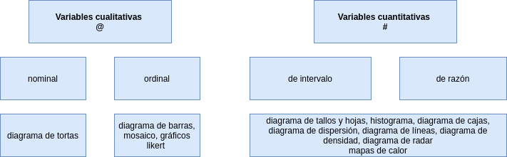

```{r setup, include=FALSE}
library(learnr)
knitr::opts_chunk$set(echo = FALSE,
                 exercise.warn_invisible = FALSE)
# colores
c1="#FF7F00" # NARANJA COLOR PRINCIPAL
c2="#034a94" # AZUL FUERTE COLOR SECUNDARIO  
c3="#0eb0c6" # AZUL CLARO COLOR TERCEARIO  
c4="#686868" # GRIS COLOR TEXTO 

```

## **PRESENTACIÓN**

```{r, echo=FALSE, out.width="100%", fig.align = "center"}
knitr::include_graphics("images/tutorial_encabezado.jpg")
```

</br></br>

### **CONCEPTOS**

La representación gráfica tiene un paple principal  en el análsis de datos. La representación adecuada la información contenida en una base forma parte del proceso de la Ciencia de Datos.

La elección del tipo de gráfica está asociada con el tipo de variable y su escla de medición, además de otros factores relacionados con la modelación de lo que se desee resaltar.

</br></br>

|Tipo de variable  | Escala          | Gráfico                                   | código R             | 
|:-----------------|:----------------|:------------------------------------------|:---------------------|
|**Cualitativas**  |                 |                                           |                      |  
|                  |                 |                                           | `t=table(x)`         |        
|                  |Nominal          | torta                                     | ``pie(t)`            |
|                  |Ordinal          | barras                                    | `barplot(t)`         |
|**Cuantitativas** |                 |                                           |                      |
|                  |Intervalo-razón  | diagrama de tallos y hojas                | `stem(x)`            |
|                  |                 | histograma                                | `hist(x)`            |
|                  |                 | diagrama de cajas                         | `boxplot(x)`         |
|                  |                 | diagrama de densidad                      | `plot(density(x))`   |
|                  |                 | diagrama de puntos                        | `plot(x)`            |
|                  |                 |                                           |                      |

</br></br>

### **MAPA CONCEPTUAL**

```{r, echo=FALSE, , out.width="100%", fig.align = "center"}
  

```

</br></br>

## **CUESTIONARIO**


```{r, echo=FALSE}
ev=c(12,40,42)
ev=as.table(ev)
names(ev)=c("Bajo","Medio","Alto")
barplot(ev,  col=c("#f95738","#faf0ca", "#0d3b66"), 
        main = "Nivel tecnológico",
        las=1, ylim =c(0,50), ylab="%")
grid()
```


### PREGUNTA 1

```{r quiz_1}
quiz(
  question("A partir de la gráfica anterior se puede afirmar que:", 
  allow_retry = TRUE,
    answer("el nivel tecnológico en promedio es de (12+40+42)/3", message = "No, pero no...intentalo de nuevo!"),
    answer("el nivel tecnológico presenta un valor medio o promedio igual 40%", message = "Nop...intentalo de nuevo!"),
    answer("el nivel tecnológico es una variable cualitativa de escala nominal y presenta una moda igual a bajo", message = "Incorrecto. Intenta de nuevo!."),
    answer("la muestra indica que solo un 12% de las empesas analizadas presenta un nivel tecnológico bajo", correct = TRUE),
    # Si no cambiamos estos textos en los botones, se mostrarán en Inglés  
    submit_button = "Enviar respuesta",
      correct = "Correcto!",
    incorrect = "Incorrecto!",
    try_again_button = "Intentar de nuevo"),
  # Si no ponemos un caption aparecerá la palabra Quiz en inglés.
   caption = " "
)
```


### PREGUNTA 2

```{r quiz_2}
quiz( 
  question("El diagrama de barras se utiliza para representar", 
  allow_retry = TRUE,
    answer("variables cualitativas de razón", message = "No, pero no...intentalo de nuevo!"),
    answer("variables cuantitativas discretas", message = "Nop...intentalo de nuevo!"),
    answer("variables cuantitativas continuas", message = "Incorrecto. Intenta de nuevo!."),
    answer("variables cuantitativas ordinales", correct = TRUE),
    # Si no cambiamos estos textos en los botones, se mostrarán en Inglés  
    submit_button = "Enviar respuesta",
      correct = "Correcto!",
    incorrect = "Incorrecto!",
    try_again_button = "Intentar de nuevo"),
  # Si no ponemos un caption aparecerá la palabra Quiz en inglés.
   caption = " "
 )
```


### PREGUNTA 3

```{r quiz_3}
quiz(  
  question("El diagrama de cajas permite", 
  allow_retry = TRUE,
    answer("visualizar la media de los datos", message = "No, pero no...intentalo de nuevo!"),
    answer("estimar la varianza de los datos", message = "Nop...intentalo de nuevo!"),
    answer("detectar los valores atípicos", correct = TRUE),
    answer("si existen valores faltantes", message = "Incorrecto. Intenta de nuevo!."),
    # Si no cambiamos estos textos en los botones, se mostrarán en Inglés  
    submit_button = "Enviar respuesta",
      correct = "Correcto!",
    incorrect = "Incorrecto!",
    try_again_button = "Intentar de nuevo"),
  # Si no ponemos un caption aparecerá la palabra Quiz en inglés.
   caption = " "
)
```


### PREGUNTA 4

```{r quiz_4}
quiz(  
  question("El diagrama de dispersión permite esencialmente", 
  allow_retry = TRUE,
    answer("detectar datos atípicos de una variable", message = "Cerca, pero no...intentalo de nuevo!"),
    answer("que tan cerca estan los datos de la media", message = "No...intentalo de nuevo!"),
    answer("detectar el grado de asociación lineal entre dos variables cuantitativas", correct = TRUE),
    answer("detectar que variable tiene más valores", message = "Incorrecto. Intenta de nuevo!."),
    # Si no cambiamos estos textos en los botones, se mostrarán en Inglés  
    submit_button = "Enviar respuesta",
      correct = "Correcto!",
    incorrect = "Incorrecto!",
    try_again_button = "Intentar de nuevo"),
  # Si no ponemos un caption aparecerá la palabra Quiz en inglés.
   caption = " "
)
```


### PREGUNTA 5


```{r quiz_5}
quiz(  
  question("El diagrama de tortas se emplea para la representación de variables medidas en escala", 
  allow_retry = TRUE,
    answer("nominal", correct = TRUE),
    answer("ordinal", message = "Nop...intentalo de nuevo!"),
    answer("de intervalo", message = "Incorrecto. Intenta de nuevo!."),
    answer("de razón", message = "No, pero no...intentalo de nuevo!"),
    # Si no cambiamos estos textos en los botones, se mostrarán en Inglés  
    submit_button = "Enviar respuesta",
      correct = "Correcto!",
    incorrect = "Incorrecto!",
    try_again_button = "Intentar de nuevo"),
  # Si no ponemos un caption aparecerá la palabra Quiz en inglés.
   caption = " "
)
```


### PREGUNTA 6

```{r quiz_6}
quiz(  
  question("El histograma se utiliza para representar una variable", 
  allow_retry = TRUE,
    answer("Cualitativa nominal", message = "Cerca, pero no...intentalo de nuevo!"),
    answer("Cuantitativa ordinal", message = "Nop...intentalo de nuevo!"),
    answer("Cuantitativa continua", correct = TRUE),
    answer("Cualitativa ordinal", message = "Incorrecto. Intenta de nuevo!."),
    # Si no cambiamos estos textos en los botones, se mostrarán en Inglés  
    submit_button = "Enviar respuesta",
      correct = "Correcto!",
    incorrect = "Incorrecto!",
    try_again_button = "Intentar de nuevo"),
  # Si no ponemos un caption aparecerá la palabra Quiz en inglés.
   caption = " "
)
```


## **PROBLEMAS**
 

### PROBLEMA 1

La siguiente información resumida en una tabla corresponde a la distribución de los cargos en una empresa por el sexo de sus empleados. Represente esta información de manera gráfica

<pre>
|              |Mujer      | Hombre       |
|--------------+-----------+--------------|
|Administrativo| 32        |  21          |        
|Operativo     | 62        | 140          | 
|Vendedor      | 132       | 55           |
</pre>


```{r p1, exercise=TRUE, exercise.lines = 10}
x=c(32,62,132,21,140,55)
m=matrix(x,ncol=2)
    rownames(m)=c("Adminitrativo","Operativo","Vendedor")
    colnames(m)=c("Mujer","Hombre")

    
```


```{r p1-solution}
x=c(32,62,132,21,140,55)
m=matrix(x,ncol=2)
rownames(m)=c("Adminitrativo","Operativo","Vendedor")
colnames(m)=c("Mujer","Hombre")
m

barplot(m, 
        main = "Distribución del sexo por cargo",
        col=c("#0d3b66","#FAF0CA","#f4d35e"), 
        legend = rownames(m),
        ylim = c(0,300),
        las=1)

barplot(t(m), 
        main = "Distribución del cargo por sexo",
        col=c("#0d3b66","#FAF0CA"), 
        legend = colnames(m),
        ylim = c(0,300),
        las=1)

```


### PROBLEMA 2

Los siguientes datos corresponde los tiempos empleados por 70 atletas en una carrera 10K. Determine si existen datos atípicos en los tiempos utilizando un gráfico y en caso de tenerlos determine que valor tienen


```{r p2, exercise=TRUE, exercise.lines = 5}
x=c(51.35, 49.88, 49.35, 51.21, 51.24, 45.75, 48.42, 47.29, 48.98, 50.06, 50.94, 45.41, 55.69, 48.90, 56.00, 44.72, 56.89, 46.61, 53.25, 48.46, 49.74, 45.03, 63.02, 50.96, 50.43, 51.19, 53.45, 52.10, 49.61, 45.89, 49.76, 42.30, 53.48, 54.71, 53.48, 56.67, 44.38, 51.18, 51.06, 54.96, 64.44, 51.85, 45.33, 62.74, 43.84, 51.32, 53.70, 51.00, 52.86, 43.06, 43.63, 51.24, 52.84, 49.19, 49.56, 49.56, 51.49, 55.31, 46.74, 47.62, 51.85, 58.90, 50.80, 43.39, 48.54, 52.72, 44.82, 52.49, 58.43, 52.91)

```


```{r p2-hint}
x=c(51.35, 49.88, 49.35, 51.21, 51.24, 45.75, 48.42, 47.29, 48.98, 50.06, 50.94, 45.41, 55.69, 48.90, 56.00, 44.72, 56.89, 46.61, 53.25, 48.46, 49.74, 45.03, 63.02, 50.96, 50.43, 51.19, 53.45, 52.10, 49.61, 45.89, 49.76, 42.30, 53.48, 54.71, 53.48, 56.67, 44.38, 51.18, 51.06, 54.96, 64.44, 51.85, 45.33, 62.74, 43.84, 51.32, 53.70, 51.00, 52.86, 43.06, 43.63, 51.24, 52.84, 49.19, 49.56, 49.56, 51.49, 55.31, 46.74, 47.62, 51.85, 58.90, 50.80, 43.39, 48.54, 52.72, 44.82, 52.49, 58.43, 52.91)

boxplot(x, horizontal = TRUE)
x[68:70]
```


### PROBLEMA 3

El siguiente conjunto de datos corresponden a las edades de dos grupos de estudiantes inscritos a un programa de maestria. Determine visualmente si los dos grupos tienen iguales caracteristicas

```{r p3, exercise=TRUE, exercise.lines = 5}
G1=c(27, 27, 28, 28, 34, 28, 26, 33, 24, 28, 25, 25, 33, 27, 34, 38, 24, 26, 22, 23, 33, 23, 26, 26, 32, 33, 29, 30, 25, 23) 
G2=c(35, 25, 19, 17, 24, 17, 55, 25, 31, 35, 43, 28, 32, 19, 20, 17, 25, 18, 21, 22, 17, 35, 29, 20, 54, 46, 24, 29, 40, 18)

```


```{r p3-solution}
G1=c(27, 27, 28, 28, 34, 28, 26, 33, 24, 28, 25, 25, 33, 27, 34, 38, 24, 26, 22, 23, 33, 23, 26, 26, 32, 33, 29, 30, 25, 23) 
G2=c(35, 25, 19, 17, 24, 17, 55, 25, 31, 35, 43, 28, 32, 19, 20, 17, 25, 18, 21, 22, 17, 35, 29, 20, 54, 46, 24, 29, 40, 18)

data=data.frame(G1,G2)
boxplot(data)
```


### PROBLEMA 4

Una evaluación realizada en clientes de un banco sobre su servicio en linea arrojó los siguientes resultados:

<pre>
* Excelente   : 32
* Muy bueno   : 43
* Bueno       : 12
* Regular     : 8
* Muy regular : 4
</pre>

Represente los resultados gráficamente

```{r p4, exercise=TRUE, exercise.lines = 5}
evaluacion=c(4,  8, 12, 43, 32)
```


```{r p4-solution}
ev=c(4, 8, 12, 43, 32)
names(ev)=c("Muy regular", "Regular", "Bueno", "Muy bueno","Excelente")
barplot(ev, col=c("#9B3A04","#DE6B07","#FF8F2D","#395F60","#203738"), main = "Evaluación servicio", las=1, ylim = c(0,50))

```


### PROBLEMA 5

El resultado de una encuesta de clima laboral arrojo los siguientes resultados:

<pre>
|Pregunta | TA |  A | N | D | TD |
|---------+----+----+---+---+----|
| 1       | 3  |  4 | 2 | 5 | 2  |
| 2       | 4  |  3 | 5 | 2 | 4  |
| 3       | 2  |  5 | 3 | 4 | 3  |
</pre>

Donde:
TD : Totalmente en desacuerdo
D : En desacuerdo
N : Neutral 
A : De acuerdo
TA : Totalmente de acuerdo

Represente los resultados gráficamente

```{r p5, exercise=TRUE, exercise.lines = 15}
library(likert)
library(ggplot2)

data <- data.frame(
  Pregunta1 = c(3, 4, 2, 5, 2),
  Pregunta2 = c(4, 3, 5, 2, 4),
  Pregunta3 = c(2, 5, 3, 4, 3)
)

labels <- c("Totalmente en desacuerdo", "En desacuerdo", "Neutral", "De acuerdo", "Totalmente de acuerdo")

```


```{r p5-solution}
library(likert)
library(ggplot2)

# Crear un dataframe de ejemplo
data <- data.frame(
  Pregunta1 = factor(c(3, 4, 2, 5, 2)),
  Pregunta2 = factor(c(4, 3, 5, 2, 4)),
  Pregunta3 = factor(c(2, 5, 3, 4, 3))
)

order <- c("Pregunta1", "Pregunta2", "Pregunta3")
lbls <- c("Totalmente en desacuerdo", "En desacuerdo", "Neutral", "De acuerdo", "Totalmente de acuerdo")
likert_data <- likert(data)
likert_data$labels <- lbls
likert_plot <- plot(likert_data)
print(likert_plot)
```


