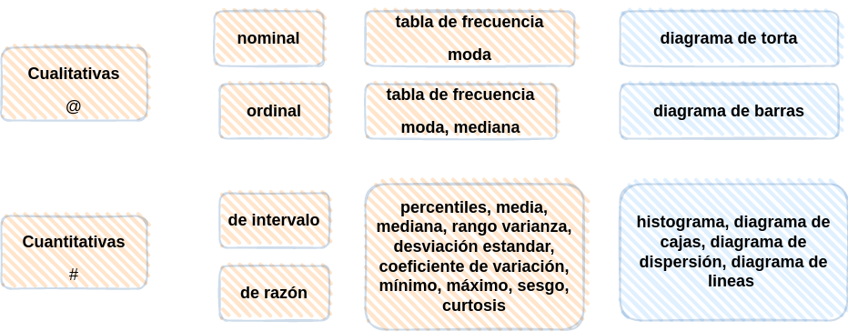
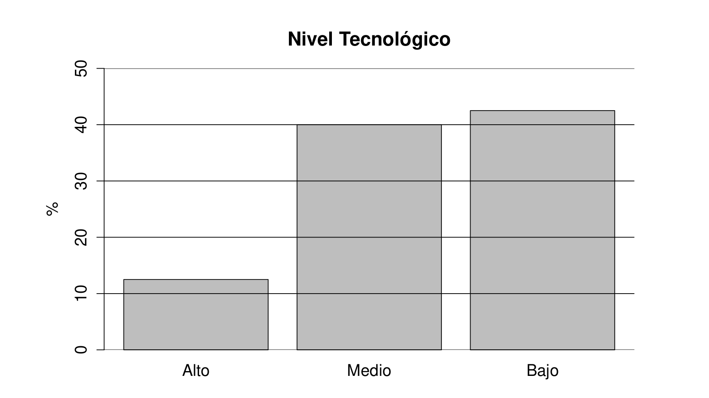

```{r setup, include=FALSE}
library(learnr)
knitr::opts_chunk$set(echo = FALSE,
                 exercise.warn_invisible = FALSE)
# colores
c0="#FF7F00" # naranja. color principal
c1="#034A94" # azul fuerte. color secundario
c2="#0EB0C6" # azul claro. color terciario  
c3="#686868" # gris. color texto  

c4="#0B2545" # azul oscuro  
c5="#E9C46A" # amarillo

```

## **PRESENTACIÓN**

```{r, echo=FALSE, out.width="100%", fig.align = "center"}
knitr::include_graphics("images/tutorial_encabezado.jpg")
```

</br></br>

### **CONCEPTOS**

La representación gráfica tiene un paple primordil en el análsis de datos. Saber representar de manera adecuada la información contenida en una base forma parte del proceso de la Ciencia de Datos.

La representación de los datos está asociada con el tipo de variable y su escla de medición, además de otros factores relacionados con la modelación de lo que se desee resaltar.

</br></br>

|Tipo de variable  | Escala          | Gráfico                                   | código R             | 
|:-----------------|:----------------|:------------------------------------------|:---------------------|
|Cualitativas      |                 |                                           | `t=table(x)`         |        
|                  |Nominal          | torta                                     | ``pie(t)`            |
|                  |Ordinal          | barras                                    | `barplot(t)`         |
|                  |                 |                                           |                      |
|Cuantitativas     |Intervalo-razón  | diagrama de tallos y hojas                | `stem(x)`            |
|                  |                 | histograma                                | `hist(x)`            |
|                  |                 | diagrama de cajas                         | `boxplot(x)`         |
|                  |                 | diagrama de densidad                      | `plot(density(x))`   |
|                  |                 | diagrama de puntos                        | `plot(x)`            |


</br></br>

### **MAPA CONCEPTUAL**

```{r, echo=FALSE, , out.width="80%", fig.align = "center"}
  

```

</br></br>

## **CUESTIONARIO**

```{r, echo=FALSE, out.width="50%", fig.align = "center"}

```

### PREGUNTA 1

```{r quiz_1}
quiz(
  question("A partir de la gráfica anterior se puede afirmar que:", 
  allow_retry = TRUE,
    answer("el nivel tecnológico en promedio es de (12+40+42)/3", message = "No, pero no...intentalo de nuevo!"),
    answer("el nivel tecnológico presenta un valor medio o promedio igual 40%", message = "Nop...intentalo de nuevo!"),
    answer("el nivel tecnológico es una variable cualitativa de escala nominal y presenta una moda igual a bajo", message = "Incorrecto. Intenta de nuevo!."),
    answer("la muestra indica que solo un 12% de las empesas analizadas presenta un nivel tecnológico alto ", correct = TRUE),
    # Si no cambiamos estos textos en los botones, se mostrarán en Inglés  
    submit_button = "Enviar respuesta",
    try_again_button = "Intentar de nuevo"),
  # Si no ponemos un caption aparecerá la palabra Quiz en inglés.
   caption = " "
)
```


### PREGUNTA 2

```{r quiz_2}
quiz( 
  question("El diagrama de barras se utiliza para representar", 
  allow_retry = TRUE,
    answer("variables cualitativas de razón", message = "No, pero no...intentalo de nuevo!"),
    answer("variables cuantitativas discretas", message = "Nop...intentalo de nuevo!"),
    answer("variables cuantitativas continuas", message = "Incorrecto. Intenta de nuevo!."),
    answer("variables cuantitativas ordinales", correct = TRUE),
    # Si no cambiamos estos textos en los botones, se mostrarán en Inglés  
    submit_button = "Enviar respuesta",
    try_again_button = "Intentar de nuevo"),
  # Si no ponemos un caption aparecerá la palabra Quiz en inglés.
   caption = " "
 )
```


### PREGUNTA 3

```{r quiz_3}
quiz(  
  question("El diagrama de cajas permite", 
  allow_retry = TRUE,
    answer("visualizar la media de los datos", message = "No, pero no...intentalo de nuevo!"),
    answer("estimar la varianza de los datos", message = "Nop...intentalo de nuevo!"),
    answer("detectar los valores atípicos", correct = TRUE),
    answer("si existen valores faltantes", message = "Incorrecto. Intenta de nuevo!."),
    # Si no cambiamos estos textos en los botones, se mostrarán en Inglés  
    submit_button = "Enviar respuesta",
    try_again_button = "Intentar de nuevo"),
  # Si no ponemos un caption aparecerá la palabra Quiz en inglés.
   caption = " "
)
```


### PREGUNTA 4

```{r quiz_4}
quiz(  
  question("El diagrama de dispersión permite esencialmente", 
  allow_retry = TRUE,
    answer("detectar datos atípicos de una variable", message = "Cerca, pero no...intentalo de nuevo!"),
    answer("que tancerca estan los datos de la media", message = "Nop...intentalo de nuevo!"),
    answer("detectar el grado de asociación entre dos variables cuantitativas", correct = TRUE),
    answer("detectar que variable tiene más valores", message = "Incorrecto. Intenta de nuevo!."),
    # Si no cambiamos estos textos en los botones, se mostrarán en Inglés  
    submit_button = "Enviar respuesta",
    try_again_button = "Intentar de nuevo"),
  # Si no ponemos un caption aparecerá la palabra Quiz en inglés.
   caption = " "
)
```


### PREGUNTA 5


```{r quiz_5}
quiz(  
  question("¿El diagrama de tortas se emplea para la representación de variables medidas en escala", 
  allow_retry = TRUE,
    answer("nominal", correct = TRUE),
    answer("ordinal", message = "Nop...intentalo de nuevo!"),
    answer("de intervalo", message = "Incorrecto. Intenta de nuevo!."),
    answer("de razón", message = "No, pero no...intentalo de nuevo!"),
    # Si no cambiamos estos textos en los botones, se mostrarán en Inglés  
    submit_button = "Enviar respuesta",
    try_again_button = "Intentar de nuevo"),
  # Si no ponemos un caption aparecerá la palabra Quiz en inglés.
   caption = " "
)
```


### PREGUNTA 6

```{r quiz_6}
quiz(  
  question("El histograma se utiliza para representar una variable", 
  allow_retry = TRUE,
    answer("Cualitativa nominal", message = "Cerca, pero no...intentalo de nuevo!"),
    answer("Cuantitativa ordinal", message = "Nop...intentalo de nuevo!"),
    answer("Cuantitativa continua", correct = TRUE),
    answer("Cualitativa ordinal", message = "Incorrecto. Intenta de nuevo!."),
    # Si no cambiamos estos textos en los botones, se mostrarán en Inglés  
    submit_button = "Enviar respuesta",
    try_again_button = "Intentar de nuevo"),
  # Si no ponemos un caption aparecerá la palabra Quiz en inglés.
   caption = " "
)
```


 ## **PROBLEMAS**
 

### PREGUNTA 1

ENUNCIADO


```{r p1, exercise=TRUE, exercise.lines = 5}

```


```{r p1-hint}


```


### PREGUNTA 2

ENUNCIADO


```{r p2, exercise=TRUE, exercise.lines = 5}

```


```{r p2-hint}


```


### PREGUNTA 3

ENUNCIADO


```{r p3, exercise=TRUE, exercise.lines = 5}

```


```{r p3-hint}


```


### PREGUNTA 4

ENUNCIADO


```{r p4, exercise=TRUE, exercise.lines = 5}

```


```{r p4-hint}


```


### PREGUNTA 5

ENUNCIADO


```{r p5, exercise=TRUE, exercise.lines = 5}

```


```{r p5-hint}


```