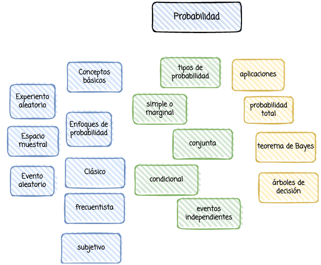
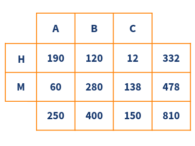

```{r setup, include=FALSE}
library(learnr)
knitr::opts_chunk$set(echo = FALSE,
                 exercise.warn_invisible = FALSE)
# colores
c1="#FF7F00" # NARANJA COLOR PRINCIPAL
c2="#034a94" # AZUL FUERTE COLOR SECUNDARIO  
c3="#0eb0c6" # AZUL CLARO COLOR TERCEARIO  
c4="#686868" # GRIS COLOR TEXTO 

```


## **PRESENTACIÓN**

```{r, echo=FALSE, out.width="80%", fig.align = "center"}

```

</br></br>

### **MAPA CONCEPTUAL**

```{r, echo=FALSE, , out.width="100%", fig.align = "center"}
  

```

</br></br>

## **CUESTIONARIO**

### PREGUNTA 1

```{r quiz_1}
quiz(  
  question("Sea P(A) = 0.50 y P(B) = 0.30, donde A y B son eventos independientes. Entonces se puede afirmar que: ", allow_retry = TRUE,
    answer("P(A | B) = 0.50", correct = TRUE), 
    answer("P(B | A) = 0.50 ", message = "No, pero no...intentalo de nuevo!"),
    answer("P(A ∩ B) =0.50", message = "Incorrecto. Intenta de nuevo!."),
    answer("P(A ∪ B)= 0.50", message = "No...intentalo de nuevo!"),
    # Si no cambiamos estos textos en los botones, se mostrarán en Inglés  
    submit_button = "Enviar respuesta",
    correct = "Correcto!",
    incorrect = "Incorrecto!",
    try_again_button = "Intentar de nuevo"),
  # Si no ponemos un caption aparecerá la palabra Quiz en inglés.
   caption = " "
)
```


### PREGUNTA 2

```{r quiz_2}
quiz(  
  question("Sea P(A) = 0.50 y P(B) = 0.30 y P(A ∩ B) = 0.20, podemos afirmar que",  allow_retry = TRUE,
    answer("P(A') = 0.3", message = "No...intentalo de nuevo!"),
    answer("P(B') = 0.50 ", message = "No, pero no...intentalo de nuevo!"),
    answer("P(A ∪ B) = 0.60" , correct = TRUE), 
    answer("P(A ∩ B') = 0.60", message = "Incorrecto. Intenta de nuevo!."),
    # Si no cambiamos estos textos en los botones, se mostrarán en Inglés  
    submit_button = "Enviar respuesta",
    correct = "Correcto!",
    incorrect = "Incorrecto!",
    try_again_button = "Intentar de nuevo"),
  # Si no ponemos un caption aparecerá la palabra Quiz en inglés.
   caption = " "
)
```


### PREGUNTA 3

```{r quiz_3}
quiz(  
  question("Sea P(A) = 0.50 y P(B) = 0.30 y P(A ∩ B) = 0.20, podemos afirmar que", allow_retry = TRUE,
    answer("P(A' ∩ B) =0.20", message = "No, pero no...intentalo de nuevo!"),
    answer("A y B no son eventos independientes", correct = TRUE), 
    answer("A ∩ B = ϕ", message = "Incorrecto. Intenta de nuevo!."),
    answer("A ∩ B = S", message = "No...intentalo de nuevo!"),
    # Si no cambiamos estos textos en los botones, se mostrarán en Inglés  
    submit_button = "Enviar respuesta",
    correct = "Correcto!",
    incorrect = "Incorrecto!",
    try_again_button = "Intentar de nuevo"),
  # Si no ponemos un caption aparecerá la palabra Quiz en inglés.
   caption = " "
)
```

### PREGUNTA 4

La siguiente tabla corresponde a información sobre el sexo y la preferencia de tres tipos de transporte por parte de 810 pasajeros. 

```{r, echo=FALSE, , out.width="50%", fig.align = "center"}
  
```


```{r quiz_4}
quiz(  
  question("Apartir de ella se puede afirmar: ", 
  allow_retry = TRUE,
    answer("P(A ∩ H) = 190/332", message = "Incorrecto. Intenta de nuevo!."),
    answer("P(A ∩ M) = 60/478", message = "No, pero no...intentalo de nuevo!"),
    answer("P(H ∩ B) = 120/810", correct = TRUE),
    answer("P(M | B) = 280/810", message = "No...intentalo de nuevo!"),
    # Si no cambiamos estos textos en los botones, se mostrarán en Inglés  
    submit_button = "Enviar respuesta",
    correct = "Correcto!",
    incorrect = "Incorrecto!",
    try_again_button = "Intentar de nuevo"),
  # Si no ponemos un caption aparecerá la palabra Quiz en inglés.
   caption = " "
)
```

### PREGUNTA 5

```{r quiz_5}
quiz(  
  question("Para cualquier par de eventos A y B, ¿cuál de las siguientes afirmaciones no es cierta?", 
  allow_retry = TRUE,
    answer("P(S) = 1 ", message = "Incorrecto. Intenta de nuevo!."),
    answer("P(A′) = 1 − P(A) ", message = "No, pero no...intentalo de nuevo!"),
    answer("P(A∪B) = P(A) + P(B)", correct = TRUE), 
    answer("0 ≤ P(A) ≤ 1", message = "No...intentalo de nuevo!"),
    # Si no cambiamos estos textos en los botones, se mostrarán en Inglés  
    submit_button = "Enviar respuesta",
    correct = "Correcto!",
    incorrect = "Incorrecto!",
    try_again_button = "Intentar de nuevo"),
  # Si no ponemos un caption aparecerá la palabra Quiz en inglés.
   caption = " "
)
```

## **PROBLEMAS**

### **PROBLEMA 1**


La siguiente es una clasificación, según el género y el nivel de
escolaridad, de una muestra aleatoria de 200 adultos.

<pre>
| Escolaridad    | H: Hombre | M: Mujer |
|----------------+-----------+----------|
| P: Primaria    | 38        | 45       |
| S: Secundaria  | 28        | 50       |
| U: Universidad | 22        | 17       |
</pre>

Si se elige una persona al azar de este grupo, ¿cuál es la probabilidad de que la persona sea hombre, dado que su escolaridad es de secundaria?

```{r p1, exercise=TRUE}
 
```

```{r p1-solution}
cat("P(S) =", 78/200)
cat("P(H | S) = P(H ∩ S) / P(S)=", (28/200)/(78/200))
```

### PROBLEMA 2

La probabilidad de que un propietario de un automovil que entra a una estación de servicio necesite cambiarle el aceite es 0.25, la probabilidad de que este mismo cliente tenga que cambiar el filtro de aire es 0.40, y la probabilidad de que se necesite cambiarle el aceite y el filtro es 0.14.  Si se le tiene que cambiar el aceite, ¿cuál es la probabilidad de que también se necesite cambiarle el filtro?
    
```{r p2, exercise=TRUE}
```

```{r p2-solution}
cat("Sean los eventos:")
cat("A: se necesita cambiar el aceite del vehiculo.")
cat("F: se necesita cambiar el filtro de aceite del vehiculo.")
Prob_A = 0.25     # P(cambiar aceite)
Prob_F = 0.40     # P(cambiar filtro de aire)
Prob_AF = 0.14    # P(cambiar aceite y filtro de aire)
cat("P(F|A)=", Prob_AF/Prob_A)
```


