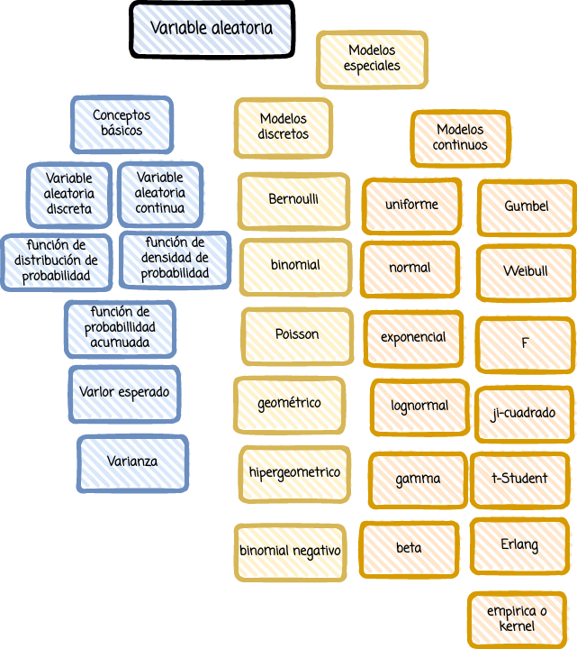

```{r setup, include=FALSE}
library(learnr)
knitr::opts_chunk$set(echo = FALSE,
                 exercise.warn_invisible = FALSE)
# colores

c1="#FF7F00" # NARANJA COLOR PRINCIPAL
c2="#034a94" # AZUL FUERTE COLOR SECUNDARIO  
c3="#0eb0c6" # AZUL CLARO COLOR TERCEARIO  
c4="#686868" # GRIS COLOR TEXTO 


```


## **PRESENTACIÓN**

```{r, echo=FALSE, out.width="100%", fig.align = "center"}
knitr::include_graphics("images/tutorial_encabezado.jpg")
```

</br></br>

### **CONCEPTOS**

</br></br>

### **MAPA CONCEPTUAL**

```{r, echo=FALSE, , out.width="80%", fig.align = "center"}
  

```

</br></br>

</br></br>

## **CUESTIONARIO**

### PREGUNTA 1

```{r quiz_1}
quiz(  
  question("pregunta ", 
  allow_retry = TRUE,
    answer("opción 1 ", correct = TRUE), 
    answer("opción 2 ", message = "No, pero no...intentalo de nuevo!"),
    answer("opción 4", message = "Incorrecto. Intenta de nuevo!."),
    answer("opción 4", message = "Nop...intentalo de nuevo!"),
    # Si no cambiamos estos textos en los botones, se mostrarán en Inglés  
    submit_button = "Enviar respuesta",
    correct = "Correcto!",
    incorrect = "Incorrecto!",
    try_again_button = "Intentar de nuevo"),
  # Si no ponemos un caption aparecerá la palabra Quiz en inglés.
   caption = " "
)
```


### PREGUNTA 2

```{r quiz_2}
quiz(  
  question("pregunta ", 
  allow_retry = TRUE,
    answer("opción 1 ", correct = TRUE), 
    answer("opción 2 ", message = "No, pero no...intentalo de nuevo!"),
    answer("opción 4", message = "Incorrecto. Intenta de nuevo!."),
    answer("opción 4", message = "Nop...intentalo de nuevo!"),
    # Si no cambiamos estos textos en los botones, se mostrarán en Inglés  
    submit_button = "Enviar respuesta",
    correct = "Correcto!",
    incorrect = "Incorrecto!",
    try_again_button = "Intentar de nuevo"),
  # Si no ponemos un caption aparecerá la palabra Quiz en inglés.
   caption = " "
)
```


### PREGUNTA 3

```{r quiz_3}
quiz(  
  question("pregunta ", 
  allow_retry = TRUE,
    answer("opción 1 ", correct = TRUE), 
    answer("opción 2 ", message = "No, pero no...intentalo de nuevo!"),
    answer("opción 4", message = "Incorrecto. Intenta de nuevo!."),
    answer("opción 4", message = "Nop...intentalo de nuevo!"),
    # Si no cambiamos estos textos en los botones, se mostrarán en Inglés  
    submit_button = "Enviar respuesta",
    correct = "Correcto!",
    incorrect = "Incorrecto!",
    try_again_button = "Intentar de nuevo"),
  # Si no ponemos un caption aparecerá la palabra Quiz en inglés.
   caption = " "
)
```

### PREGUNTA 4

```{r quiz_4}
quiz(  
  question("pregunta ", 
  allow_retry = TRUE,
    answer("opción 1 ", correct = TRUE), 
    answer("opción 2 ", message = "No, pero no...intentalo de nuevo!"),
    answer("opción 4", message = "Incorrecto. Intenta de nuevo!."),
    answer("opción 4", message = "Nop...intentalo de nuevo!"),
    # Si no cambiamos estos textos en los botones, se mostrarán en Inglés  
    submit_button = "Enviar respuesta",
    correct = "Correcto!",
    incorrect = "Incorrecto!",
    try_again_button = "Intentar de nuevo"),
  # Si no ponemos un caption aparecerá la palabra Quiz en inglés.
   caption = " "
)
```

### PREGUNTA 5

```{r quiz_5}
quiz(  
  question(" ", 
  allow_retry = TRUE,
    answer("opción 1 ", correct = TRUE), 
    answer("opción 2 ", message = "No, pero no...intentalo de nuevo!"),
    answer("opción 4", message = "Incorrecto. Intenta de nuevo!."),
    answer("opción 4", message = "Nop...intentalo de nuevo!"),
    # Si no cambiamos estos textos en los botones, se mostrarán en Inglés  
    submit_button = "Enviar respuesta",
    correct = "Correcto!",
    incorrect = "Incorrecto!",
    try_again_button = "Intentar de nuevo"),
  # Si no ponemos un caption aparecerá la palabra Quiz en inglés.
   caption = " "
)
```

## **PROBLEMAS**

### **PROBLEMA 1**


Existe interés por la vida de un componente electrónico. Suponga que se sabe que la probabilidad de que el componente funcione más de 6000 horas
es 0.42. Suponga, además, que la probabilidad de que el componente no dure más de 4000 horas es 0.04.

¿Cuál es la probabilidad de que la vida del componente sea menor o  igual a 6000 horas?

```{r 64a, exercise=TRUE}
 
```

```{r 64a-solution}
1-0.42
```


