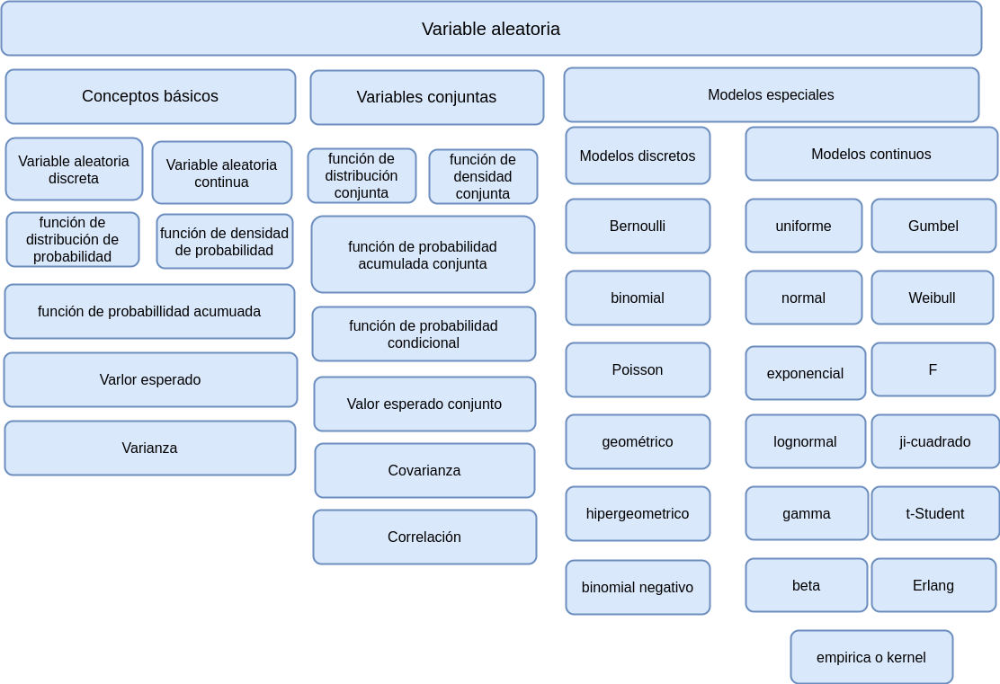

```{r setup, include=FALSE}
library(learnr)
knitr::opts_chunk$set(echo = FALSE,
                 exercise.warn_invisible = FALSE)
# colores

c1="#FF7F00" # NARANJA COLOR PRINCIPAL
c2="#034a94" # AZUL FUERTE COLOR SECUNDARIO  
c3="#0eb0c6" # AZUL CLARO COLOR TERCEARIO  
c4="#686868" # GRIS COLOR TEXTO 


```


## **PRESENTACIÓN**

```{r, echo=FALSE, out.width="100%", fig.align = "center"}

```

</br></br>

### **CONCEPTOS**

*Una variable aleatoria se puede definir como una función que asocia valores numéricos a eventos resultantes de un experimento aleatorio*


</br>

#### **Variable aleatoria** : 

función que asigna a cada elemento de un espacio muestral asociado a un experimento aleatorio un número

</br>

#### **Variable aleatoria discreta** : 

variable cuyo conjunto de valores posibles (rango) es un conjunto finito o infinito numerable

</br>

####  **Variable aleatoria continua** : 

variable cuyo conjunto de valores posibles es un conjunto infinito de valores no numerables

</br>

####  **Función de distribución de probabilidad** : 

función que asigna a cada valor de una variable aleatoria discreta un valor de probabilidad. 

* $f(x)\geq 0$ 
* $\displaystyle \sum_{R_{X}} f(x) =1$

</br>

#### **función de densidad de probabilidad** : 

función que asigna a cada valor de la variable aletoria contunua un valor. 

* $f(x)\geq0$  
* $\displaystyle \int f(x) \hspace{.2cm}dx =1$

</br>

#### **función de probabilidad acumulada** : 

$F(x) = P(X \leq x)$


</br>

#### **valor esperado** : 

$E[X] = \mu$ media poblacional

</br>

#### **varianza** : 

$V[X] = \sigma^2$ : varianza poblacional

</br></br>

#### **modelos discretos**

* Bernoulli        
* binomial         
* Poisson         
* hipergeométrico 
* geométrico o de Pascal 
* binomial negativo

</br></br>

#### **modelos continuos**

* uniforme        
* normal        
* exponencial     
* gamma          
* Weibull        
* Cauchy          
* lognormal       
* beta          
* Erlang          
* Gumbel         
* t-Student      
* F               
* ji-cuadrado   
* empírica o kernel

</br></br>

### **MAPA CONCEPTUAL**

```{r, echo=FALSE, , out.width="100%", fig.align = "center"}
  

```

</br></br>

</br></br>

## **CUESTIONARIO**

### PREGUNTA 1

```{r quiz_1}
quiz(  
  question("De las siguientes variables, cuál no es una variable discreta", 
  allow_retry = TRUE,
    answer("accidentes automovilísticos que ocurren al año en una ciudad determinada ", message = "No, pero no...intentalo de nuevo!"),
    answer("permisos para construcción que los funcionarios de una  ciudad emiten cada mes", message = "Incorrecto. Intenta de nuevo!."),
    answer("edad de un estudiante universitario", correct = TRUE), 
    answer("huevos que una gallina pone mensualmente", message = "Nop...intentalo de nuevo!"),
    # Si no cambiamos estos textos en los botones, se mostrarán en Inglés  
    submit_button = "Enviar respuesta",
    correct = "Correcto!",
    incorrect = "Incorrecto!",
    try_again_button = "Intentar de nuevo"),
  # Si no ponemos un caption aparecerá la palabra Quiz en inglés.
   caption = " "
)
```


### PREGUNTA 2

```{r quiz_2}
quiz(  
  question("De los siguientes modelos, cuál corresponde a un modelo continuo ", 
  allow_retry = TRUE,
    answer("binomial", message = "Nop...intentalo de nuevo!"),
    answer("Poisson", message = "No, pero no...intentalo de nuevo!"),
    answer("Bernoulli", message = "Incorrecto. Intenta de nuevo!."),
    answer("exponencial", correct = TRUE), 
    # Si no cambiamos estos textos en los botones, se mostrarán en Inglés  
    submit_button = "Enviar respuesta",
    correct = "Correcto!",
    incorrect = "Incorrecto!",
    try_again_button = "Intentar de nuevo"),
  # Si no ponemos un caption aparecerá la palabra Quiz en inglés.
   caption = " "
)
```


### PREGUNTA 3

```{r quiz_3}
quiz(  
  question("De los siguientes modelos, cuál no es un modelo continuo", 
  allow_retry = TRUE,
    answer("normal", message = "Nop...intentalo de nuevo!"),
    answer("uniforme", message = "No, pero no...intentalo de nuevo!"),
    answer("Weibull", message = "Incorrecto. Intenta de nuevo!."),
    answer("binomial" , correct = TRUE), 
    # Si no cambiamos estos textos en los botones, se mostrarán en Inglés  
    submit_button = "Enviar respuesta",
    correct = "Correcto!",
    incorrect = "Incorrecto!",
    try_again_button = "Intentar de nuevo"),
  # Si no ponemos un caption aparecerá la palabra Quiz en inglés.
   caption = " "
)
```

### PREGUNTA 4

```{r quiz_4}
quiz(  
  question("La función de R que permite simular 1000 números aleatorios con distribución normal con media 10 y varianza 1 es: ", 
  allow_retry = TRUE,
    answer("pnorm(1000,10,1)", message = "No, pero no...intentalo de nuevo!"),
    answer("dnorm(1000,10,1)", message = "Incorrecto. Intenta de nuevo!."),
    answer("rnorm(1000,10,1) ", correct = TRUE), 
    answer("randnorm(1000,10,1)", message = "Nop...intentalo de nuevo!"),
    # Si no cambiamos estos textos en los botones, se mostrarán en Inglés  
    submit_button = "Enviar respuesta",
    correct = "Correcto!",
    incorrect = "Incorrecto!",
    try_again_button = "Intentar de nuevo"),
  # Si no ponemos un caption aparecerá la palabra Quiz en inglés.
   caption = " "
)
```

### PREGUNTA 5

Para la variable aleatoria que tiene la siguiente función de distribución de probabilidad :

<pre>
| x    | -2    |  -1    |  0     |  1     |  2     |
|------+-------+--------+--------+--------+--------|
| f(x) | 1/8   |  2/8   |  2/8   |  2/8   |  1/8   |
</pre>

```{r quiz_5}
quiz(  
  question("no podemos afirmar que:", 
  allow_retry = TRUE,
    answer("P(X > 0 ) =3/8", message = "No, pero no...intentalo de nuevo!"),
    answer("P(X ≤ 2 ) =7/8", correct = TRUE), 
    answer("P(X = 2/8) = 0", message = "Incorrecto. Intenta de nuevo!."),
    answer("P(X > -1)  = 5/8", message = "Nop...intentalo de nuevo!"),
    # Si no cambiamos estos textos en los botones, se mostrarán en Inglés  
    submit_button = "Enviar respuesta",
    correct = "Correcto!",
    incorrect = "Incorrecto!",
    try_again_button = "Intentar de nuevo"),
  # Si no ponemos un caption aparecerá la palabra Quiz en inglés.
   caption = " "
)
```

## **PROBLEMAS**

### **PROBLEMA 1**

Para una variable aleatoria con distribución binomial  $X \sim binom(x, n=10, p=0.20)$ determine las probabidades:

a. $P(X =4)$

b. $P(X \leq 4)$

c. $P(X > 4)$

```{r p1, exercise=TRUE}

```

```{r p1-solution}
# P(X = 4)
dbinom(4,10,0.20)

# P(/X >= 4)
pbinom(4,10,0.20)

# P(X > 4)
pbinom(4, 10,0.20, lower.tail = FALSE)
```


### **PROBLEMA 2**

Para una variable aleatoria continua $X\sim norm(\mu=150, \sigma^{2}=100)$ determine:

a. $P(X < 140)$

b. $P( 140 < X < 165)$  

c. $P(X > 165)$


```{r p2, exercise=TRUE}
 
```

```{r p2-solution}
# a.  P(X< 140)
pnorm(140,150,10)

# b. P(140 < X < 160)
pnorm(165,150,10) - pnorm(140,150,10)

# c. P(X > 160)
pnorm(165, 150,10, lower.tail = FALSE)

```

